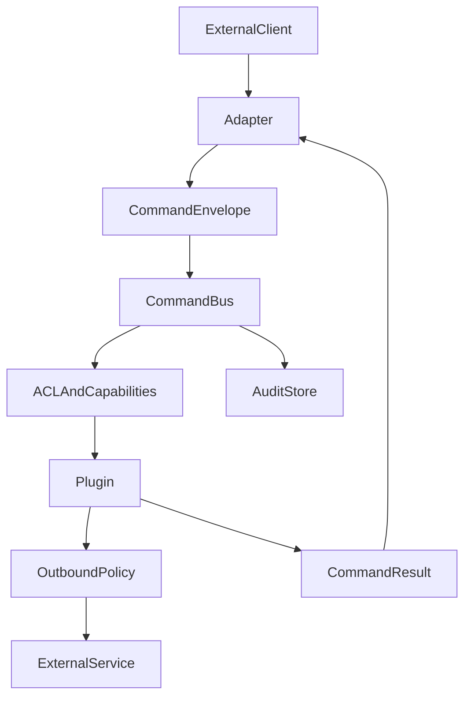

# Architecture

## Repository structure and dependency rule

This project uses a module-per-concern model:

`hubcore` is a **library module**, not a runtime service.
Every executable in this repository is a separate binary that imports shared libraries at build time.
There is no deployable `hubcore` daemon.

- `sshbot` runtime has no compile-time dependency on dashboard modules.
- `apps/dashboard` imports `hubcore` and `sdk/hubrelay` for UI and transport.
- `hubcore` and `apps/dashboard/ui8kit` stay reusable and do not depend on runtime internals.

The resulting dependency direction is one-way and supports independent team ownership.

## Core Model
Every external request is normalized into a command envelope before business logic runs.

## Contracts
- Shared contracts live in `pkg/contract` and are imported by runtime, SDK, and future app consumers.
- `Principal`: normalized identity with roles, scope, transport metadata, and version slot.
- `CommandEnvelope`: transport-neutral request with command name, arguments, metadata, correlation ID, and version slot.
- `CommandResult`: structured response with text, data payload, policy flags, and machine-readable `code`/`kind`.
- `Capability`: immutable runtime feature exposed by the deployed image.
- `Plugin`: typed command handler gated by capabilities and policy.
- `Adapter`: transport bridge that converts external events into command envelopes and sends responses back.
- `OutboundPolicy`: shared workload egress layer that decides whether a plugin may call an external service directly, through a lease, or not at all.
- `AuditEntry`: immutable record of a handled command attempt.

## Command Flow
1. Adapter receives a message or request.
2. Adapter resolves a `Principal`.
3. Adapter emits a `CommandEnvelope`.
4. Core validates principal, policy, and required capability.
5. Core dispatches to the matching plugin.
6. If the plugin needs external egress, it must ask `OutboundPolicy` for a routing decision.
7. Result is written to audit and returned through the adapter.

## Transport strategy for UI and integrations

The command contract is transport-agnostic. The same command contract should be exposed through multiple transports:

- HTTP JSON is the base transport (`/api/command`, `/api/command/stream`) and stays supported for compatibility.
- gRPC is now available as a parallel service transport for BFF/gateway clients that need multiplexed connections and server-streaming without changing the core command contract.
- Unix socket remains for local, privileged control-plane integrations.

In `apps/dashboard`, transport selection is handled in the SDK/source layer:

- `sdk/hubrelay` now exposes a transport facade (`CommandTransport`) instead of wiring HTTP paths directly in app code.
- `apps/dashboard/internal/relay` now selects the SDK client by transport config instead of hardcoding HTTP vs Unix constructor branches.
- The current gRPC implementation uses a JSON codec over gRPC service methods, so there is no protobuf generation step in the current build pipeline.
- `apps/dashboard/internal/source` consumes the same methods (`Health`, `Capabilities`, `Ask`, `AskStream`, `Egress`, `Audit`) independent of transport.
- Browser widgets should consume pointwise endpoints; no full-page websocket conversion is required for this direction.
- Existing UI streaming still runs via SSE while the backend transport for dashboard internals can switch to gRPC by config.

Runtime composition also moved one level up:

- plugins are now collected through a registry/factory pattern in `cmd/bot`,
- the immutable runtime profile still describes capabilities, but a generic `Config` map is now part of the profile snapshot used by contracts and clients,
- this keeps future consumers from depending on hardcoded adapter/provider struct fields.

Decision matrix:

- Choose HTTP when compatibility, simplicity, or external tooling parity is the priority.
- Choose gRPC when service-to-service streaming, one long-lived connection, or dashboard/backend calls over SSH tunnel are required.

## Outbound Rule
- workload outbound policy must live above individual plugins,
- AI is only the first consumer of that layer,
- proxy health checks remain a separate control-plane path and are not treated as normal workload outbound traffic.

## Operator documentation
End-to-end English guides live in [`docs/`](../docs/README.md) (installation through deploy). Short design notes remain in this folder.
