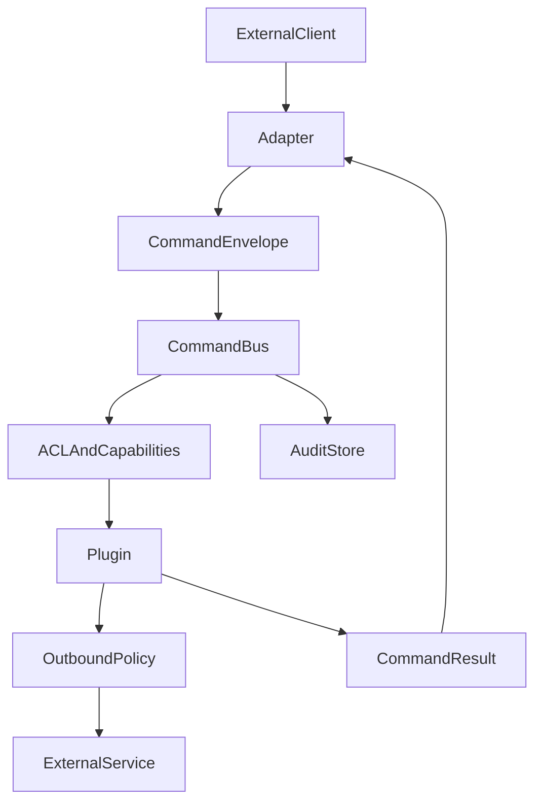

# Architecture

## Repository structure and dependency rule

This project uses a module-per-concern model:

`hubcore` is a **library module**, not a runtime service.
Every executable in this repository is a separate binary that imports shared libraries at build time.
There is no deployable `hubcore` daemon.

- `sshbot` runtime has no compile-time dependency on dashboard modules.
- `apps/dashboard` imports `hubcore` and `sdk/hubrelay` for UI and transport.
- `hubcore` and `apps/dashboard/ui8kit` stay reusable and do not depend on runtime internals.

The resulting dependency direction is one-way and supports independent team ownership.

## Core Model
Every external request is normalized into a command envelope before business logic runs.

## Contracts
- `Principal`: normalized identity with roles and transport metadata.
- `CommandEnvelope`: transport-neutral request with command name, arguments, metadata, and correlation ID.
- `CommandResult`: structured response with text, data payload, and policy flags.
- `Capability`: immutable runtime feature exposed by the deployed image.
- `Plugin`: typed command handler gated by capabilities and policy.
- `Adapter`: transport bridge that converts external events into command envelopes and sends responses back.
- `OutboundPolicy`: shared workload egress layer that decides whether a plugin may call an external service directly, through a lease, or not at all.
- `AuditEntry`: immutable record of a handled command attempt.

## Command Flow
1. Adapter receives a message or request.
2. Adapter resolves a `Principal`.
3. Adapter emits a `CommandEnvelope`.
4. Core validates principal, policy, and required capability.
5. Core dispatches to the matching plugin.
6. If the plugin needs external egress, it must ask `OutboundPolicy` for a routing decision.
7. Result is written to audit and returned through the adapter.

## Outbound Rule
- workload outbound policy must live above individual plugins,
- AI is only the first consumer of that layer,
- proxy health checks remain a separate control-plane path and are not treated as normal workload outbound traffic.

## Operator documentation
End-to-end English guides live in [`docs/`](../docs/README.md) (installation through deploy). Short design notes remain in this folder.
