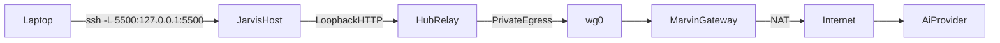

# WireGuard Private Egress Onboarding

**New to the stack?** Read **[HUBRELAY_SYSTEM_GUIDE.md](HUBRELAY_SYSTEM_GUIDE.md)** first — it explains how the HubRelay binary, configuration, and Linux networking fit together in English from end to end.

## Purpose

This document captures the SRE-level implementation context for the WireGuard-based private egress model used by HubRelay.

It is intentionally sanitized:
- no real secrets,
- no operator-specific credentials,
- no real customer prompts,
- no sensitive host metadata beyond generic placeholders.

The goal is to provide a ready-to-use onboarding reference for future operators and maintainers.

## Scope

This onboarding covers:
- `Marvin` as the private egress gateway,
- `Jarvis` as the HubRelay host,
- WireGuard running on the host OS,
- loopback-only HubRelay access over `ssh -L`,
- fail-closed routing intent for AI/provider traffic,
- operational debugging and maintenance commands.

## Architecture Summary



## Design Intent

- Operator access stays on loopback HTTP and SSH tunneling.
- Public ingress is not used for the HubRelay command surface.
- AI/provider egress is intended to leave only through `wg0`.
- `Marvin` acts as a WireGuard gateway and NAT egress node, not as an application proxy.
- Sensitive AI payloads should not be logged by the application.
- If private egress is unavailable, outbound provider requests should fail closed.

## Hosts

### Marvin

Role:
- WireGuard endpoint
- private egress gateway
- NAT node for tunnel clients

Operating model:
- receives encrypted WireGuard traffic on UDP `51820`
- forwards traffic from `wg0` to the external interface
- performs source NAT for the tunnel subnet

### Jarvis

Role:
- primary HubRelay host
- loopback HTTP endpoint for the operator
- WireGuard peer to `Marvin`

Operating model:
- `HubRelay` listens on `127.0.0.1:5500`
- operator connects with `ssh -L`
- WireGuard runs on the host, not inside the application
- routing policy is intended to steer HubRelay outbound traffic through `wg0`

## Implemented Work Summary

### Completed on Marvin

- Installed `wireguard`, `wireguard-tools`, and `nftables`.
- Generated and protected WireGuard keys under `/etc/wireguard`.
- Enabled `net.ipv4.ip_forward=1`.
- Created `wg0` with a private tunnel subnet.
- Added NAT masquerade for tunnel traffic leaving the public interface.
- Enabled `wg-quick@wg0` at boot.
- Verified the WireGuard listener on UDP `51820`.

### Completed on Jarvis

- Validated the existing runtime and discovered a running Docker-based HubRelay instance.
- Installed host-side WireGuard tooling.
- Generated Jarvis WireGuard keys and configured `wg0`.
- Added Jarvis as a peer on `Marvin`.
- Verified WireGuard handshake and reachability to the gateway tunnel address.
- Created routing groundwork for future fail-closed egress policy.
- Performed a host-run cutover so HubRelay can bind to `127.0.0.1:5500` outside Docker.

## Current Runtime State

Expected state when the stack is fully deployed:

- `Marvin` acts as a WireGuard gateway and NAT egress node.
- `Jarvis` has a live WireGuard peer, handshake with `Marvin`, and policy routing for the `hubrelay` user through `wg0`.
- HubRelay runs as a **host-run** systemd service bound to `127.0.0.1:5500`.
- An **`ip rule` exception** routes UDP to the WG peer endpoint via the **main** table (avoids encapsulation routing loops).
- `/healthz`, `capabilities`, and **`ask`** can be validated end-to-end; provider traffic exits via Marvin’s public IP when routing is correct.

See [HUBRELAY_SYSTEM_GUIDE.md](HUBRELAY_SYSTEM_GUIDE.md) for the application and routing mental model.

## Security Model

### What this setup protects well

- The command surface remains loopback-only.
- Operator access is tunneled through SSH.
- WireGuard encrypts host-to-host transit between `Jarvis` and `Marvin`.
- `Marvin` does not terminate application-layer TLS for AI/provider traffic.
- The egress gateway does not need to store prompts or responses at the application layer.

### What this setup does not guarantee

- A VPS provider can still observe network metadata outside application control.
- Host-level logging, hypervisor telemetry, or provider-side flow collection cannot be fully excluded.
- "No logs at all" is not a realistic guarantee on rented infrastructure.

The realistic SRE statement is:
- minimize visibility,
- avoid local payload logging,
- encrypt transport,
- fail closed when the private path is unavailable.

## Files and System Artifacts

### Marvin

Expected artifacts:
- `/etc/wireguard/wg0.conf`
- `/etc/wireguard/*.key`
- `/etc/wireguard/*.pub`
- `/etc/sysctl.d/99-wireguard-forward.conf`
- `/etc/nftables.conf`

### Jarvis

Expected artifacts:
- `/etc/wireguard/wg0.conf`
- `/etc/wireguard/jarvis.key`
- `/etc/wireguard/jarvis.pub`
- `/etc/nftables.d/hubrelay-egress.nft`
- `/usr/local/sbin/hubrelay-net-up`
- `/usr/local/sbin/hubrelay-net-down`
- `/etc/systemd/system/hubrelay.service`

## Recommended Application Configuration

For the private egress design, the long-term deploy target is:

```bash
INPUT_PROXY_SESSION_ENABLED=false
INPUT_PROXY_SESSION_FORCE=false
INPUT_PRIVATE_EGRESS_REQUIRED=true
INPUT_PRIVATE_EGRESS_INTERFACE=wg0
INPUT_PRIVATE_EGRESS_TEST_HOST=10.88.0.1
INPUT_PRIVATE_EGRESS_FAIL_CLOSED=true
```

Rationale:
- proxy session semantics belong to SOCKS-style userspace egress,
- WireGuard is a host networking concern,
- HubRelay should validate that private egress exists,
- Linux routing and firewall rules should enforce the actual path.

## Operational Runbook

## Baseline Checks

### Jarvis

```bash
hostnamectl
uname -r
ip -br a
ip route
resolvectl status 2>/dev/null || cat /etc/resolv.conf
timedatectl
ss -lntup
```

### Marvin

```bash
hostnamectl
uname -r
ip -br a
ip route
sysctl net.ipv4.ip_forward
nft list ruleset
ss -lunp | grep 51820
```

## WireGuard Health Checks

### Jarvis

```bash
wg show
ip -br a show wg0
ping -c 3 10.88.0.1
systemctl status wg-quick@wg0 --no-pager
```

### Marvin

```bash
wg show
ip -br a show wg0
ss -lunp | grep 51820
systemctl status wg-quick@wg0 --no-pager
```

What to look for:
- a recent handshake,
- growing transfer counters,
- the correct tunnel IP,
- no restart loop in the systemd unit.

## Routing and Fail-Closed Checks

### Jarvis

```bash
ip rule show
ip route show table 88
nft list table inet hubrelay_egress
id hubrelay
```

Useful path inspection:

```bash
ip route get 10.88.0.1 uid <hubrelay_uid>
ip route get 1.1.1.1 uid <hubrelay_uid>
```

Expected behavior:
- traffic for the HubRelay service user resolves into the WireGuard-specific table,
- loopback remains available,
- direct egress outside `wg0` should be blocked or fail closed once final policy is in place.

## HubRelay Service Checks

### Service state

```bash
systemctl status hubrelay.service --no-pager
systemctl cat hubrelay.service
ss -lntup | grep 5500
```

### Local health

```bash
curl -s http://127.0.0.1:5500/healthz
```

### Capabilities

```bash
curl -s http://127.0.0.1:5500/api/command \
  -X POST \
  -H "Content-Type: application/json" \
  -d '{"principal_id":"operator-local","roles":["operator"],"command":"capabilities"}'
```

### Simple ask test

```bash
curl -s http://127.0.0.1:5500/api/command \
  -X POST \
  -H "Content-Type: application/json" \
  -d '{"principal_id":"operator-local","roles":["operator"],"command":"ask","args":{"prompt":"hello"}}'
```

## Operator Access

Use SSH port forwarding from the workstation:

```bash
ssh -N -L 5500:127.0.0.1:5500 <operator>@<jarvis_public_ip>
```

Then open:

```text
http://127.0.0.1:5500
```

## Safe Restart Commands

### Jarvis

```bash
systemctl restart wg-quick@wg0
systemctl restart hubrelay.service
systemctl daemon-reload
```

### Marvin

```bash
systemctl restart wg-quick@wg0
systemctl restart nftables
```

## Useful Diagnostics

### WireGuard

```bash
wg show
journalctl -u wg-quick@wg0 -n 100 --no-pager
```

### HubRelay

```bash
journalctl -u hubrelay.service -n 100 --no-pager
curl -s http://127.0.0.1:5500/healthz
```

### Routing

```bash
ip rule show
ip route
ip route show table 88
nft list ruleset
```

### DNS

```bash
getent hosts api.cerebras.ai
resolvectl status
```

### Connectivity

```bash
ping -c 3 10.88.0.1
ping -c 3 1.1.1.1
curl -I --max-time 10 https://example.com
```

## Failure Patterns and Interpretation

### Handshake missing

Symptoms:
- no recent handshake in `wg show`
- zero or near-zero transfer counters

Check:
- peer public keys
- endpoint IP and UDP port
- provider firewall or security group
- service state on both ends

### Handshake present, but no traffic

Symptoms:
- handshake exists
- tunnel IP does not answer
- counters do not grow with test traffic

Check:
- `AllowedIPs`
- interface address assignment
- `nftables` forward/NAT rules
- routing table on the client side

### Local health works, `ask` fails

Symptoms:
- `/healthz` works
- `capabilities` works
- `ask` times out or returns provider transport errors

Check:
- private egress routing for the HubRelay service user
- provider DNS resolution
- direct HTTPS connectivity under the service account
- fail-closed policy behavior

### DNS works, but HTTPS fails

Symptoms:
- `getent hosts` resolves
- outbound provider connection times out or reports unreachable

Check:
- route selection for the service account
- egress firewall policy
- NAT behavior on `Marvin`
- provider IP reachability through `wg0`

## Recommended Next Steps

The remaining engineering work should focus on productizing private egress in the application profile and deploy model:

- add `INPUT_PRIVATE_EGRESS_REQUIRED`
- add `INPUT_PRIVATE_EGRESS_INTERFACE`
- add `INPUT_PRIVATE_EGRESS_TEST_HOST`
- add `INPUT_PRIVATE_EGRESS_FAIL_CLOSED`
- keep `INPUT_PROXY_SESSION_*` disabled for WireGuard-based deployments

This allows HubRelay to:
- run in direct provider mode,
- verify private egress before AI requests,
- fail closed if `wg0` or the private path is unavailable.

## Final Notes

This WireGuard model is the correct direction for an SRE-operated private egress design:
- simple transport,
- minimal dependencies,
- loopback-only control plane,
- encrypted host-to-host path,
- host-enforced routing policy.

The application should validate the private path.
The operating system should enforce it.
