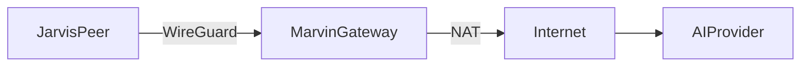

# Marvin Egress Gateway

## Purpose

This document records the SRE work completed on the US-based VDS used as `Marvin`, the private egress gateway for HubRelay.

It focuses only on the gateway node:
- what was prepared,
- what was configured,
- what was validated,
- what operators should check during maintenance.

All values below are intentionally sanitized.

## Host Role

`Marvin` is not an application proxy.

It is a host-level network role:
- WireGuard endpoint,
- private egress gateway,
- NAT node for HubRelay peers.

Its job is to:
- accept encrypted tunnel traffic,
- forward it to the public internet,
- preserve application-layer TLS end to end,
- avoid storing AI prompts or responses at the application layer.

## Environment

The gateway was prepared on a US VDS with:
- Debian 12,
- Linux kernel with WireGuard module support,
- one public interface for internet egress,
- WireGuard bound on UDP `51820`,
- a private tunnel subnet for HubRelay peers.

## Work Completed

### 1. Baseline Validation

Before changes, the server was checked for:
- OS and kernel version,
- default route,
- DNS configuration,
- NTP synchronization,
- RAM and disk headroom,
- external IP and region,
- WireGuard kernel module availability,
- firewall state.

This confirmed the host was suitable for a host-level WireGuard deployment.

### 2. Package Installation

Installed:
- `wireguard`
- `wireguard-tools`
- `nftables`

Purpose:
- WireGuard interface management,
- peer key generation,
- host-level forwarding and NAT policy.

### 3. Key Material

Generated a gateway keypair under `/etc/wireguard` and locked down file permissions.

Security expectations:
- the private key stays only on `Marvin`,
- the public key is shared with peers,
- file permissions remain restricted to `root`.

### 4. Kernel Forwarding

Enabled IPv4 forwarding on the host so tunnel traffic can traverse the VDS:

- `net.ipv4.ip_forward=1`

This is required because `Marvin` is acting as a transit node, not only as a local WireGuard endpoint.

### 5. WireGuard Interface

Created `wg0` with:
- a private gateway address,
- a dedicated tunnel subnet,
- a listening UDP port,
- peer entries for tunnel clients.

Autostart was enabled via `wg-quick@wg0`.

### 6. NAT and Forwarding Policy

Configured `nftables` so that:
- traffic arriving on `wg0` can leave via the public interface,
- reply traffic is allowed back,
- tunnel subnet traffic is masqueraded on internet egress.

This makes `Marvin` a true egress gateway instead of just a reachable tunnel endpoint.

### 7. Peer Enrollment

Added `Jarvis` as a peer with:
- its public key,
- its tunnel IP as an `AllowedIPs` entry.

This allowed point-to-point encrypted reachability from the HubRelay host to the gateway.

### 8. Validation

Validated:
- `wg0` comes up cleanly,
- UDP `51820` is listening,
- handshake appears in `wg show`,
- traffic counters increase,
- peer tunnel IP responds,
- forwarding and NAT rules are active.

## Resulting Gateway Behavior

After the completed work, `Marvin` behaves as:

- a WireGuard server on UDP `51820`,
- a private tunnel concentrator,
- a NAT egress node for HubRelay-originated outbound traffic.

Traffic model:



## Security Notes

### What Marvin does not do

`Marvin` does not:
- run HubRelay itself,
- terminate provider TLS on behalf of the application,
- store application-level AI payloads,
- act as a SOCKS proxy in userspace,
- intentionally persist prompts or answers.

### What still exists at system level

Even in this model, the host may still expose:
- WireGuard handshake metadata,
- packet and byte counters,
- systemd service logs,
- standard Linux network state,
- provider-visible metadata outside application control.

That is acceptable for the intended SRE model, but it should not be described as "zero observability."

## Operational Checks

### Gateway identity and network

```bash
hostnamectl
uname -r
ip -br a
ip route
```

### WireGuard state

```bash
wg show
ip -br a show wg0
ss -lunp | grep 51820
systemctl status wg-quick@wg0 --no-pager
```

### Forwarding and NAT

```bash
sysctl net.ipv4.ip_forward
nft list ruleset
```

### Health expectations

Operators should confirm:
- recent handshake timestamps,
- non-zero transfer counters,
- `wg0` address present,
- UDP `51820` listening,
- forwarding enabled,
- NAT rule present for the tunnel subnet.

## Safe Maintenance Commands

### Restart WireGuard

```bash
systemctl restart wg-quick@wg0
```

### Restart firewall policy

```bash
systemctl restart nftables
```

### Inspect recent logs

```bash
journalctl -u wg-quick@wg0 -n 100 --no-pager
journalctl -u nftables -n 100 --no-pager
```

## Failure Interpretation

### No handshake

Likely causes:
- wrong peer public key,
- wrong endpoint IP,
- blocked UDP `51820`,
- stopped WireGuard unit.

### Handshake exists, but no peer traffic

Likely causes:
- bad `AllowedIPs`,
- missing forwarding,
- missing NAT,
- wrong interface name in firewall rules.

### Peer reaches gateway, but not internet

Likely causes:
- NAT rule missing,
- forward chain too strict,
- public interface mismatch,
- provider-side filtering.

## Recommended Operator Rule

Treat `Marvin` as a network appliance:
- keep it simple,
- keep it host-based,
- avoid unrelated application workloads,
- keep the forwarding/NAT logic explicit,
- do not overload it with application proxy features unless absolutely necessary.

## Summary

The US VDS was successfully turned into a private egress gateway for HubRelay by:
- enabling WireGuard on the host,
- configuring `wg0`,
- enabling IP forwarding,
- applying `nftables` forwarding and masquerade rules,
- enrolling HubRelay peers,
- validating encrypted reachability and gateway behavior.

This is the correct minimal-dependency SRE pattern for private outbound control:
- network enforcement on the host,
- encrypted transport between nodes,
- no application proxy dependency,
- no unnecessary exposure of the HubRelay control plane.
