# Streaming

This document explains how HubRelay streams command output from plugins to clients in real time.

The first production use case is the `ask` command over HTTP Server-Sent Events (SSE), but the contract is transport-agnostic and is meant to support future adapters such as WebSocket, gRPC, or SDK-specific client bindings.

## Goals

- Preserve the existing synchronous plugin contract.
- Add an optional streaming path for plugins that can emit incremental output.
- Keep loopback-only deployment and SSH tunneling unchanged.
- Reuse the same capability checks, safety checks, audit behavior, and outbound policy.
- Stay backward-compatible with existing HTTP JSON clients.

## Architecture

```mermaid
flowchart LR
  Client[Client]
  HttpAdapter[HTTPAdapter]
  Service[core.Service]
  AskPlugin[ask.Plugin]
  Provider[OpenAICompatibleProvider]
  Egress[PrivateEgress]

  Client -->|"POST /api/command/stream"| HttpAdapter
  HttpAdapter -->|CommandEnvelope| Service
  Service -->|ExecuteStream| AskPlugin
  AskPlugin -->|AskStream| Provider
  Provider -->|HTTPS via egress policy| Egress
```



## Core Contract

The base `Plugin` interface is unchanged:

```go
type Plugin interface {
    Descriptor() PluginDescriptor
    Execute(context.Context, CommandContext, CommandEnvelope) (CommandResult, error)
}
```

Streaming is opt-in via `StreamingPlugin`:

```go
type StreamingPlugin interface {
    Plugin
    ExecuteStream(context.Context, CommandContext, CommandEnvelope, StreamWriter) error
}
```

Streaming output is delivered through `StreamWriter`:

```go
type StreamChunk struct {
    Delta    string         `json:"delta"`
    Metadata map[string]any `json:"metadata,omitempty"`
}

type StreamWriter interface {
    WriteChunk(StreamChunk) error
    SetResult(CommandResult)
    Flush() error
}
```

### Why this shape

- `Execute()` stays stable for existing plugins and tests.
- `ExecuteStream()` gives plugin authors a simple push-based API.
- `SetResult()` lets the plugin return final metadata after the stream completes.
- `Flush()` lets the transport decide how to finish the stream (`done`, `error`, buffering, etc.).

## Service Behavior

`core.Service.ExecuteStream()` uses the same pre-dispatch path as `Execute()`:

1. normalize the envelope
2. persist principal and session state
3. resolve the plugin
4. check required capabilities
5. run the sensitive-data guard for `ask`

After that:

- if the plugin implements `StreamingPlugin`, the service calls `ExecuteStream()`
- otherwise the service falls back to `Execute()`
- if the synchronous result contains `data.answer`, the service emits it as a single stream chunk

Audit behavior is unchanged:

- one audit entry per command
- final result only
- no per-chunk audit spam

## HTTP Transport

The HTTP adapter exposes two command endpoints:

- `POST /api/command` for the existing JSON request/response flow
- `POST /api/command/stream` for streaming over SSE

### Request body

The streaming endpoint uses the same payload shape as `/api/command`:

```json
{
  "principal_id": "operator-local",
  "roles": ["operator"],
  "command": "ask",
  "args": {
    "prompt": "hello"
  }
}
```

### SSE event format

Response headers:

```text
Content-Type: text/event-stream
Cache-Control: no-cache
Connection: keep-alive
```

Normal stream:

```text
event: chunk
data: {"delta":"Hello"}

event: chunk
data: {"delta":" there"}

event: done
data: {"status":"ok","message":"ai answer generated","data":{"provider":"openai","model":"gpt-4.1-mini","response_id":"resp_abc"}}
```

Error stream:

```text
event: error
data: {"status":"error","message":"ai provider request failed: provider timeout"}
```

## AI Provider Streaming

The AI layer adds an optional streaming provider contract:

```go
type StreamingProvider interface {
    Provider
    AskStream(context.Context, AskRequest, StreamCallback) (AskResponse, error)
}
```

`OpenAICompatibleProvider` supports streaming in both configured API modes:

- `chat_completions` via `client.Chat.Completions.NewStreaming(...)`
- `responses` via `client.Responses.NewStreaming(...)`

The same controls still apply before any provider call starts:

- private egress validation
- proxy session resolution
- fail-closed outbound policy

The provider retries on transport failure only if no chunks were emitted yet. This avoids duplicated partial output after failover.

## Writing a Streaming Plugin

Example shape:

```go
func (p Plugin) ExecuteStream(ctx context.Context, cmdCtx core.CommandContext, envelope core.CommandEnvelope, writer core.StreamWriter) error {
    response, err := p.provider.AskStream(ctx, request, func(chunk ai.AskStreamChunk) error {
        return writer.WriteChunk(core.StreamChunk{Delta: chunk.Delta})
    })
    if err != nil {
        writer.SetResult(core.CommandResult{
            Status:  "error",
            Message: "provider request failed: " + err.Error(),
        })
        return err
    }

    writer.SetResult(core.CommandResult{
        Status:  "ok",
        Message: "ai answer generated",
        Data: map[string]any{
            "provider":    response.Provider,
            "model":       response.Model,
            "response_id": response.ResponseID,
        },
    })
    return nil
}
```

### Guidelines for plugin authors

- emit small deltas in natural order
- call `SetResult()` exactly once with the final status and metadata
- return an error when the stream should terminate as failed
- honor `ctx.Done()` indirectly by returning writer/provider errors immediately
- do not duplicate the full answer in `SetResult().Data["answer"]` unless the transport specifically needs it

## Client Integration

### Browser example

`EventSource` only supports `GET`, so browser clients that need `POST` should use `fetch()` and parse the SSE stream manually, or a small SDK wrapper around `ReadableStream`.

Minimal `fetch()` pattern:

```javascript
const response = await fetch("/api/command/stream", {
  method: "POST",
  headers: { "Content-Type": "application/json" },
  body: JSON.stringify({
    principal_id: "operator-local",
    roles: ["operator"],
    command: "ask",
    args: { prompt: "hello" }
  })
});

const reader = response.body.getReader();
const decoder = new TextDecoder();

while (true) {
  const { value, done } = await reader.read();
  if (done) break;
  console.log(decoder.decode(value, { stream: true }));
}
```

### `curl` example

```bash
curl -N http://127.0.0.1:5500/api/command/stream \
  -X POST \
  -H "Content-Type: application/json" \
  -d '{"principal_id":"operator-local","roles":["operator"],"command":"ask","args":{"prompt":"hello"}}'
```

## Testing Strategy

Streaming changes should be covered at three levels:

- core contract tests for buffering, fallback, and audit behavior
- plugin/provider tests for chunk delivery and fallback semantics
- adapter tests for SSE wire format and terminal `done` or `error` events

Current coverage includes:

- `internal/core/stream_test.go`
- `internal/core/service_test.go`
- `internal/plugins/ask/plugin_test.go`
- `internal/ai/openai_test.go`
- `internal/adapters/httpchat/adapter_test.go`

## Failure Modes

- If the provider fails before any chunk is emitted, the client receives `event: error`.
- If the provider fails after partial output, the client receives partial chunks followed by `event: error`.
- If the client disconnects, the request context is canceled and the provider call should exit quickly.
- If private egress validation fails, no chunk is emitted and the stream ends with an error result.
- If the sensitive-data guard blocks the request, no chunk is emitted and the stream ends with an error result.

## Notes for Future Adapters

This contract is intentionally neutral enough for future transports:

- WebSocket can map `chunk`, `done`, and `error` directly to frames.
- gRPC can map chunks to a server stream and keep the final result in trailer metadata or a final message.
- A local SDK can consume SSE today without any server-side protocol change.

The transport should stay thin. Policy enforcement, capability checks, safety checks, and audit should remain in `core.Service`.
